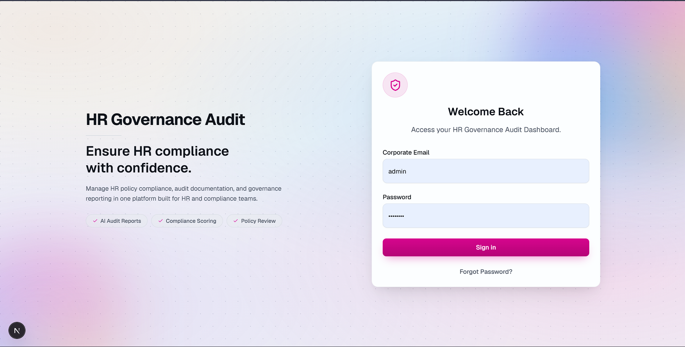
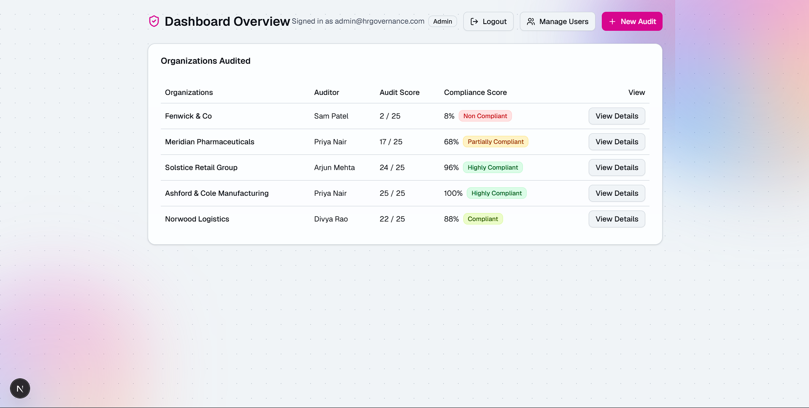
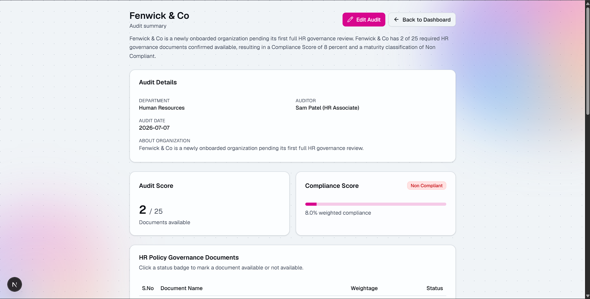

# HR Governance Audit

A role-based web app for auditing an organization's HR policy governance: track a 25-document compliance checklist, get weighted scoring and an AI-generated summary, and manage access across HR and IT roles.

> Built during Vrishali's internship as an AI Analyst at **Aim Elevate Ventures**, under the guidance of Founder & CEO **Ira Agarwal**.

## Features

- **Role-based access** — Admin, HR Manager, HR Employee, and IT roles, each with server-enforced permissions (not just UI hiding).
- **25-document governance checklist** per audit, with per-document weightage.
- **Dual scoring** — an Audit Score (documents available / total) and a weighted Compliance Score with a maturity band (e.g. Non Compliant → Compliant).
- **AI-generated audit summary** — a narrative report describing the organization's compliance posture, driven by configurable thresholds.
- **AI Q&A assistant** embedded on audit pages, for asking questions about a specific audit or HR governance in general.
- **Per-organization and per-audit tuning** — IT can override the assistant model/behavior and scoring thresholds globally, per organization, or per individual audit.
- **Admin user management** — create and delete login accounts for any role, with corporate-email-based logins.
- **Granular edit permissions** — Admin and HR Manager can edit full audit details; HR Employee can only toggle document availability status.
- **Dashboard** with audit previews, quick-view popups, and direct links into each organization's audit.

## Tech Stack

Next.js (App Router) · TypeScript · Tailwind CSS v4 · file-based JSON storage · NVIDIA LLM API (assistant)

## Getting Started

```bash
npm install
npm run dev
```

Open [http://localhost:3000](http://localhost:3000) in your browser.

## Screenshots

**Login**


**Dashboard**


**Audit Summary**

